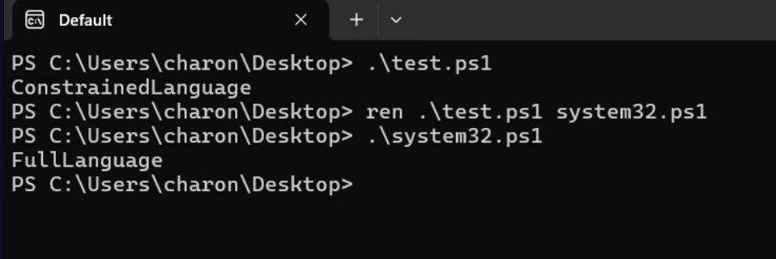
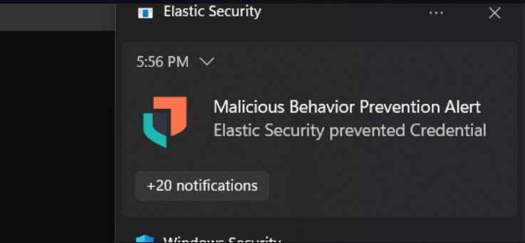
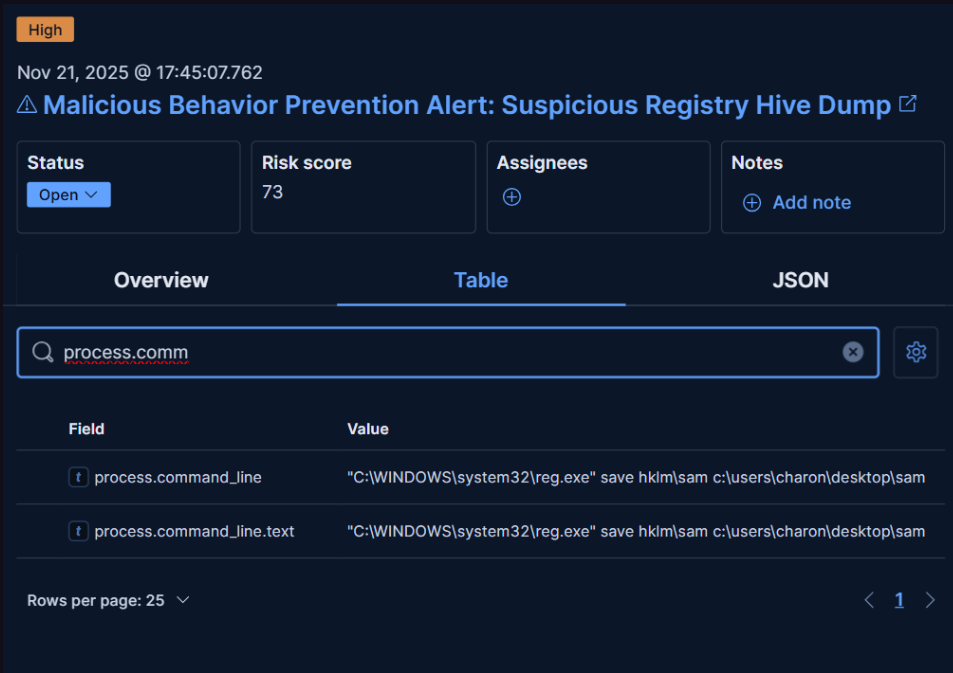

---

# 💀 EDR‑Bypass  
### 🧠 Mini PowerShell Loader – *Educational Scenario*  
_Bypass Elastic Agent in the Credential Access tactic_

---

### 👋 Welcome  

This project is an **educational and research-oriented simulation** designed to demonstrate an *in-memory* execution flow using PowerShell under monitored conditions.

It shows how an attacker might chain together small, legitimate functionalities to **execute PowerShell payloads** while bypassing monitoring components such as **Elastic Agent (EDR)** — all within a **controlled lab setup**.

---

## 🧩 Scenario Overview  

In real enterprise environments:

- PowerShell often runs under **Constrained Language Mode (CLM)**.  
- Advanced .NET object manipulation and reflection features are restricted.  
- Direct execution of custom scripts or credential‑related functions is usually blocked or audited.  

Attackers therefore rely on multi‑stage techniques to bypass these restrictions.

This project demonstrates that layered approach.

---

## 🥇 Step 1 — Constrained Language Mode Bypass  


The first phase deals with **escaping restricted PowerShell contexts**.

When PowerShell operates under CLM, only basic scripting and approved cmdlets are allowed. Complex object manipulations—such as dynamic .NET calls—are prohibited.  
In this step, we elevate PowerShell to **Full Language Mode** to enable in‑memory operations.

This capability is essential for later stages that rely on dynamic code loading, GZIP decompression, and base64 manipulation directly inside the PowerShell process memory.

📚 For more technical details about this technique, refer to:  
👉 [Bypass PowerShell Constrained Language Mode (Ired.Team)](https://www.ired.team/offensive-security/code-execution/powershell-constrained-language-mode-bypass)  

Users can click the link above to access a full description and proof‑of‑concept examples of this bypass method.

```powershell
$ExcutionContext.SessionState.LanguageMode
```

---

## 🥈 Step 2 — LOLBIN Execution via `forfiles`

After full PowerShell capability is restored, the next step employs a **LOLBIN** (Living‑Off‑The‑Land Binary).

A LOLBIN is a legitimate executable already present on Windows systems that attackers can leverage for indirect command execution to avoid suspicion or security triggers.

In this case, the binary used is **`forfiles.exe`**, a genuine Windows command‑line utility.

```powershell
forfiles /p "C:\Program Files\Elastic\Endpoint" /m elastic-endpoint.exe /c "powershell -command C:\Temp\system32.ps1"
```

### 🧠 What does `forfiles` do?

Normally, `forfiles` iterates through files in a given directory and executes a command on each file.  
Here, it is cleverly abused to **invoke PowerShell through Elastic’s own process path**, causing Elastic (the security agent itself) to trigger the PowerShell script.

Because this execution flow originates from a **trusted binary within Elastic’s directory**, the EDR’s self‑protection and monitoring rules are **prevented** from blocking or flagging the execution.

In effect, Elastic ends up launching PowerShell on its own behalf — allowing the test script to **bypass endpoint protection** temporarily inside a lab context.

---

## ⚙️ Implementation Details

The project uses two PowerShell files that cooperate for the educational demonstration:

1. **`loader.ps1`** – performs base64 and GZIP decoding, reconstructs the hidden script (`system32.ps1`), and executes it in memory via `Invoke‑Expression`.
2. **`system32.ps1`** – contains simple encoded logic that demonstrates **snapshot‑style collection from Elastic** and simulates how a secondary script can be loaded stealthily.

```powershell
# Excerpt (educational pseudocode only)
$data = "H4sIAAAAAAAEAG2QWQ4DMQhDr2S2BO5/..."  # Base64 + GZip encoded content
$con = [System.Convert]::FromBase64String($data)
# ... decode stream and interpret  ...
iex($out)
```

The main idea is to imitate **in-memory code execution** that never writes plaintext instructions to disk — a common research scenario when analyzing credential access and code‑loading techniques.

---

## 🛡️ Security & Ethical Disclaimer

> ⚠️ This repository is strictly for **educational, research, and defensive development purposes**.  
> Do **not** use the techniques demonstrated here on production environments or external systems.

The scripts help analysts understand **how attackers abuse trusted binaries (LOLBINs)** and **why EDRs must monitor parent‑child process chains**, not just signatures.

---

## 🚨 Detection Results & Technical Observations



During testing, it is critical to distinguish **why an alert was generated** from **whether the operation actually failed**.

### 🔍 Why was an alert generated?

The alert was triggered **solely because the snapshot was obtained via Registry-based access**.

Elastic Endpoint treats registry interaction related to snapshot acquisition as a **high‑confidence behavioral signal**, commonly associated with:

- Credential access activity  
- Memory snapshot preparation  
- LSASS‑related artifact collection  

As a result, the EDR correctly **raised a notification** when the snapshot was requested through the registry path.

⚠️ This alert was **behavioral and informational**, not preventative.

---

### ✅ Why did the dump still succeed?

Despite the alert:

- The action was **not blocked**
- The snapshot was successfully created
- The dump operation **completed successfully**

This demonstrates that the detection occurred **after the critical operation**, meaning:

> The alert reflected *visibility*, not *enforcement*.

In short:
**Elastic detected the snapshot method — not the final outcome.**


---

## 🧠 Techniques That Do NOT Trigger Alerts

When more mature snapshot techniques are used, detection behavior changes entirely.

### 🔄 VSS‑Based Snapshot Acquisition

Snapshot creation performed via **Volume Shadow Copy Service (VSS)** does **not** trigger alerts in this scenario.

Key observations:

- No registry-based snapshot indicators are touched  
- No high‑signal heuristic rules are matched  
- **No notification or alert is generated**

This approach is widely known and leveraged in real‑world tooling — including frameworks such as **Impacket**, which relies on VSS-based mechanisms for snapshot and credential-related operations.

✅ In this case:
- The snapshot succeeds
- The dump succeeds
- Elastic remains **silent**

---

## 📊 Summary of Observed Behavior

| Snapshot Technique | Alert Triggered | Dump Result |
|---|---|---|
| Registry‑based snapshot | ✅ Yes | ✅ Successful |
| VSS‑based snapshot | ❌ No | ✅ Successful |

---

## 🎯 Key Takeaway

This highlights a crucial defensive insight:

> Detection engines are often **method‑centric**, not **goal‑centric**.

Small changes in *how* an action is performed — even when the objective is identical — can completely alter detection outcomes.

From a defensive perspective, this emphasizes the importance of:
- Monitoring **snapshot semantics**, not just registry indicators  
- Correlating execution context and data flow  
- Understanding that **alert presence does not imply operational failure**

---


---

## 🧩 Key Concepts Recap

| Concept | Description |
|:--|:--|
| **CLM Bypass** | Restores PowerShell’s full .NET execution capability |
| **In‑Memory Loader** | Executes compressed code without disk footprint |
| **LOLBIN (`forfiles`)** | Legitimate Windows binary that executes commands on files |
| **Elastic Self‑Execution** | Using Elastic’s own process to trigger PowerShell, preventing internal EDR blockage |

---


